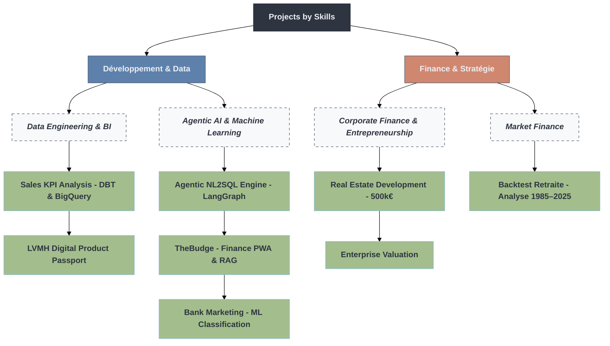

**👋 Welcome!**\
I'm Vincent Lamy, a Data Analyst currently pursuing an **MSc in Data for Finance at Albert School / Mines Paris PSL**. With a unique background combining entrepreneurship, project management, and a growing specialization in data science applied to finance, I bring both strategic thinking and hands-on technical skills to the table.

**🧠 What I Do?**
- Data Analytics: Python (Pandas, Numpy), SQL (BigQuery, Databricks, DBT)
- Data Visualization: Power BI, Looker Studio, Databricks
- Machine Learning & AI: Scikit-learn, Hugging Face, Dataiku
- AI Agents & Workflow Automation: LangChain, LangGraph, n8n (designing and deploying AI agents and automated workflows)
- Cloud & Workflow: GCP, Git/GitHub, DBT

**🔍 Current Focus.**\
I’m passionate about exploring financial data, risk modeling, and market analysis. While my day-to-day work revolves around turning data into insights, I’m also diving into automation, AI-driven solutions, and workflow optimization through personal projects. Using tools like Python, no-code platforms, and frameworks such as (LangChain/LangGraph), I’m building custom dashboards, automated workflows, and experimenting with AI to solve real-world problems. My goal is to bridge the gap between data analysis and intelligent automation, one project at a time.

**🎓 Teaching & Training.** \
As a Teaching Assistant at Le Wagon Bordeaux, I supported students in learning Python, SQL, and data storytelling through business cases and real-world datasets.

**🏗️ Previous Life.** \
Before switching to data, I spent over 10 years in the construction industry. I ran my own company, managed multi-step projects, optimized budgets, and even built my own house, an experience that taught me problem-solving, client focus, and full accountability.

**📋 Projets Portfolio.** \

**📫 Let’s connect!** \
If you're looking for a data specialist with real-world business experience, a drive to learn, and a strong interest in finance and analytics, feel free to connect:

📧 [vincent.lamy.33@gmail.com](vincent.lamy.33@gmail.com)\
🔗 [LinkedIn](https://www.linkedin.com/in/42-v-lamy/)\
📁 More projects are coming soon...
